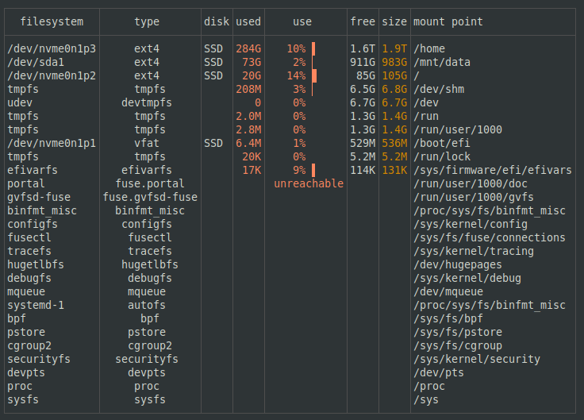
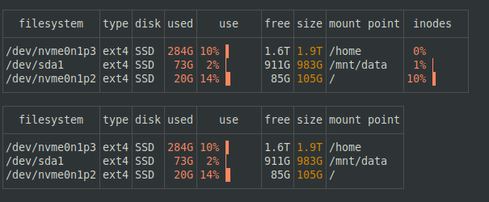
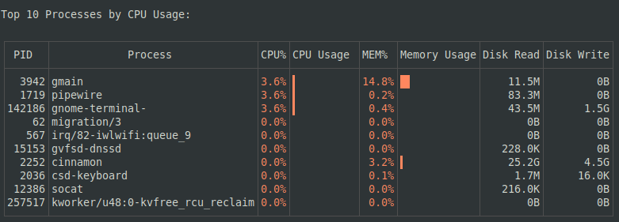
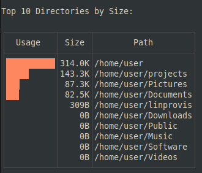
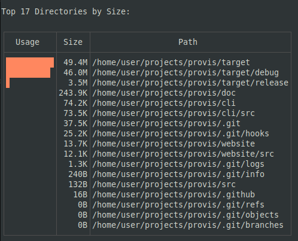

# Provis

**System monitoring and disk analysis tool for Linux**

Provis provides three powerful views for managing your system resources:
- **Filesystem view** - Monitor disk usage, mount points, and storage devices
- **Process view** - Track CPU and memory usage across running processes  
- **Directory scanner** - Analyze disk space usage with TreeSize-style filtering

Built in Rust for performance and efficiency.

---

## Features

### 📊 Filesystem Monitoring
- Real-time disk usage with visual progress bars
- Multiple filesystem types (ext4, btrfs, zfs, ntfs, etc.)
- Inode tracking and statistics
- Customizable columns and sorting
- Filter by size, type, or mount point
- JSON and CSV export




### 🔄 Process Monitoring  
- CPU and memory usage per process
- Thread aggregation by process name
- Disk I/O tracking (read/write)
- Self-filtering (excludes provis from display)
- Top N processes (default: 20)



### 📁 Directory Size Analysis
- TreeSize-style smart filtering (skips hidden dirs and build artifacts)
- Single-pass recursive scanning
- Memory-efficient heap-based algorithm (constant O(20) memory)
- Progress feedback during large scans
- Supports recursive deep scanning without OOM errors




---

## Installation

### From Release Binary
Download the latest release from [GitHub Releases](https://github.com/Canop/dysk/releases) and extract:
```bash
tar -xzf provis-*.tar.gz
sudo mv provis /usr/local/bin/
```

### From Source
Requires Rust 1.75+:
```bash
git clone https://github.com/YOUR_USERNAME/provis.git
cd provis
cargo build --release
sudo cp target/release/provis /usr/local/bin/
```

---

## Quick Start

### View Modes

```bash
# Filesystem view (default)
provis

# Process monitoring
provis --processes

# Directory size analysis
provis --size-on-disk
```

### Common Usage

```bash
# Show all filesystems including hidden
provis --all

# Monitor top 50 processes
provis -p --limit 50

# Scan home directory recursively
provis --size-on-disk /home --recursive

# Filter large filesystems
provis --filter 'size>100G'

# Add inodes column to filesystem view
provis --cols +inodes

# Export to JSON
provis --json
```

---

## Command Reference

### View Modes

| Command | Description | Example |
|---------|-------------|---------|
| `provis` | Filesystem/disk view (default) | `provis` |
| `provis --processes` or `-p` | Process monitoring view | `provis -p` |
| `provis --size-on-disk` | Directory size analysis | `provis --size-on-disk` |
| `provis --help` | Show detailed help | `provis --help` |
| `provis --commands` | Show command reference table | `provis --commands` |
| `provis --version` | Show version | `provis --version` |

### Directory Scanning Options

| Flag | Description | Example |
|------|-------------|---------|
| `--recursive` | Scan all nested folders | `provis --size-on-disk --recursive` |
| `--depth N` | Scan N levels deep (default: 1) | `provis --size-on-disk --depth 3` |
| `--limit N` | Show top N results (default: 20) | `provis --size-on-disk --limit 50` |
| `--root` | Scan from filesystem root | `provis --size-on-disk --root` |
| `--all`, `-a` | Show hidden dirs and build artifacts | `provis --size-on-disk -a` |
| `PATH` | Start scan from path | `provis --size-on-disk /home` |

### Filesystem View Options

| Flag | Description | Example |
|------|-------------|---------|
| `--all`, `-a` | Show all mount points | `provis -a` |
| `--list-cols` | List available columns | `provis --list-cols` |
| `--cols`, `-c` | Select columns to display | `provis -c +inodes` |
| `--sort`, `-s` | Sort by column | `provis -s free-desc` |
| `--filter`, `-f` | Filter filesystems | `provis -f 'size>100G'` |
| `--units`, `-u` | Size units (SI/binary/bytes) | `provis -u binary` |

### Display Options

| Flag | Description | Example |
|------|-------------|---------|
| `--color` | Color mode (auto/yes/no) | `provis --color yes` |
| `--ascii` | Use ASCII characters only | `provis --ascii` |

### Output Formats

| Flag | Description | Example |
|------|-------------|---------|
| `--json`, `-j` | JSON output | `provis -j` |
| `--csv` | CSV output | `provis --csv` |
| `--csv-separator` | CSV separator character | `provis --csv --csv-separator ';'` |

---

## Advanced Examples

### Filesystem Analysis
```bash
# Find filesystems over 80% full
provis --filter 'use>80%'

# Show only remote filesystems
provis --filter 'remote=true'

# Custom columns for detailed view
provis -c fs+type+disk+used+free+inodes+mount

# Sort by free space ascending
provis --sort free-asc

# Export filtered results to CSV
provis -f 'size>10G' --csv > large_filesystems.csv
```

### Process Monitoring
```bash
# Top 50 processes by CPU
provis -p --limit 50

# Monitor in ASCII mode (for piping/logging)
provis -p --ascii

# JSON export for scripting
provis -p --json | jq '.[] | select(.cpu > 5.0)'
```

### Directory Scanning
```bash
# Find largest directories in /var
provis --size-on-disk /var --recursive --limit 30

# Scan home showing everything (including hidden)
provis --size-on-disk /home --all --recursive

# Quick scan of immediate children only
provis --size-on-disk /opt --depth 1

# Deep scan with large result set
provis --size-on-disk / --recursive --limit all --root
```

---

## Smart Filtering

By default, directory scanner skips:
- Hidden directories (`.git`, `.cache`, `.npm`, etc.)
- Build artifacts (`node_modules`, `target`, `dist`, `build`, `__pycache__`, etc.)
- Version control (`.svn`, `.hg`)

Use `--all` to disable filtering and see everything.

---

## Performance

- **Optimized binary**: 3.5MB release build
- **Low CPU usage**: 1-5% during monitoring (release build)
- **Memory efficient**: Directory scanner uses constant O(20) memory regardless of tree size
- **Fast scanning**: Single-pass algorithm prevents redundant filesystem walks

---

## Technical Details

- Written in Rust
- Uses `sysinfo` for process monitoring
- Uses `lfs-core` for filesystem information
- Terminal UI via `termimad`
- Heap-based top-N tracking for memory efficiency

---

## Contributing

Contributions welcome. Before starting:
- Discuss features in an issue first
- Keep changes focused and simple
- Follow existing code style
- Test with `cargo test`

---

## License

MIT License - see LICENSE file

---

## Credits

Forked from [dysk](https://github.com/Canop/dysk) by Denys Séguret (dystroy)

Extended with process monitoring, directory scanning, and enhanced filtering.
